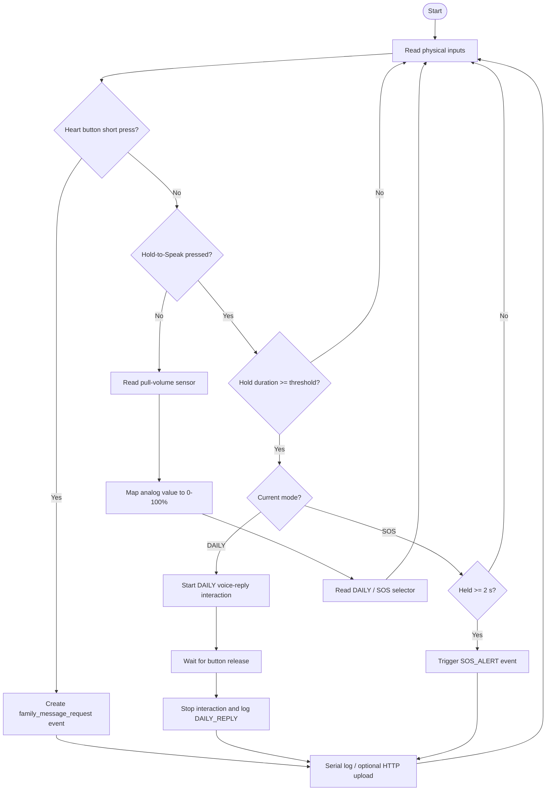
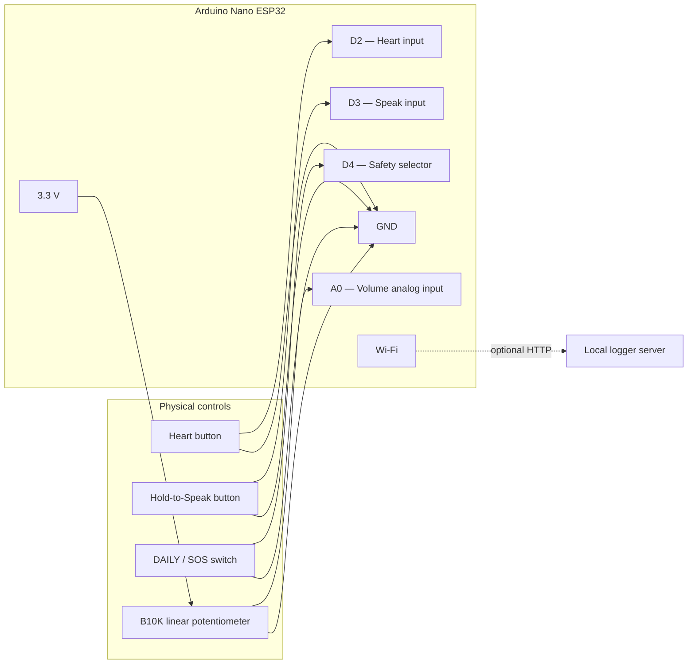

# A Test — Physical Interaction

## What this prototype tests

This test validates the mapping between **physical controls** and **device-state logic** on an Arduino Nano ESP32.

1. **Heart button** — detects a short press and records a `family_message_request` event.
2. **Hold-to-Speak** — recognises a deliberate press-and-hold gesture in DAILY mode.
3. **Pull-to-adjust volume** — maps a B10K linear potentiometer reading to 0–100% volume.
4. **DAILY / SOS selector** — changes the device state through an explicit physical switch.
5. **SOS confirmation** — requires a 2-second hold before an SOS event is accepted.
6. **Optional event upload** — sends prototype events to a local HTTP endpoint when Wi-Fi is configured.

## Hardware

- Arduino Nano ESP32
- Heart momentary button
- Hold-to-Speak momentary button
- DAILY / SOS switch
- B10K linear potentiometer
- Optional local Flask logger over Wi-Fi

All digital inputs in the example use `INPUT_PULLUP`, so pressed / active is `LOW`.

## A-test interaction flow



### What the flow validates

`Button input → Hold gesture → Mode decision → Device event → Test evidence`

The DAILY path validates a deliberate hold interaction; the SOS path adds a second safety threshold to reduce accidental emergency activation.

## A-test wiring diagram



### Example physical wiring

| Part | Connection |
|---|---|
| Heart button | one side → `D2`, other side → `GND` |
| Hold-to-Speak button | one side → `D3`, other side → `GND` |
| DAILY / SOS switch | `D4` → switch → `GND`; open = DAILY, closed = SOS |
| B10K potentiometer | one outer pin → `3.3V`, other outer pin → `GND`, wiper → `A0` |
| USB-C | programming, Serial Monitor and prototype power |
| Wi-Fi | optional HTTP event upload to local logger |

> **Pin note:** this is the test mapping used by the example firmware. If your breadboard wiring changes, update the pin constants at the top of `LoveVoice_Physical_Test.ino`.

## Files

- `LoveVoice_Physical_Test.ino` — complete A-test firmware
- `secrets.example.h` — optional Wi-Fi / local server configuration
- `logger_server.py` — optional local event logger
- `requirements.txt` — Python dependency for the logger

## Run — Serial-only test

1. Open `LoveVoice_Physical_Test.ino` in Arduino IDE.
2. Select **Arduino Nano ESP32**.
3. Adjust the pin constants if your breadboard wiring differs.
4. Upload and open Serial Monitor at `115200` baud.
5. Test the controls one by one and observe the event log.

The physical interaction test works without Wi-Fi.

## Optional — local event logging

Install and start the logger:

```bash
cd A_Physical_Interaction
pip install -r requirements.txt
python logger_server.py
```

Then copy `secrets.example.h` to `secrets.h` and set your local Wi-Fi plus:

```text
http://YOUR_COMPUTER_IP:5000/record
```

The ESP32 will POST test events to the logger. You can inspect them at:

```text
http://YOUR_COMPUTER_IP:5000/records
```

`secrets.h` is ignored by Git.

## Expected test evidence

For a portfolio usability / functional test, record:

- whether each physical action is recognised correctly;
- hold duration and accidental-trigger rate;
- whether users understand the DAILY / SOS transition;
- whether pull distance maps naturally to perceived volume;
- any interaction changes made after testing.

## Prototype boundary

This test validates **interaction logic**, not a finished medical or emergency product. Voice recording, AI processing and production-grade emergency delivery are outside the A-test scope.
