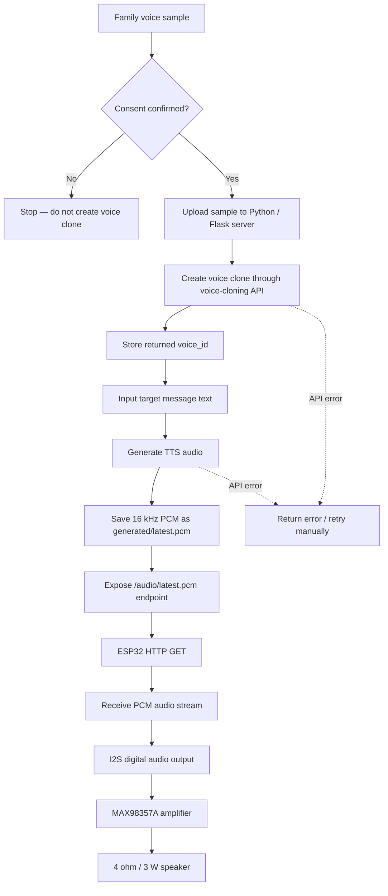
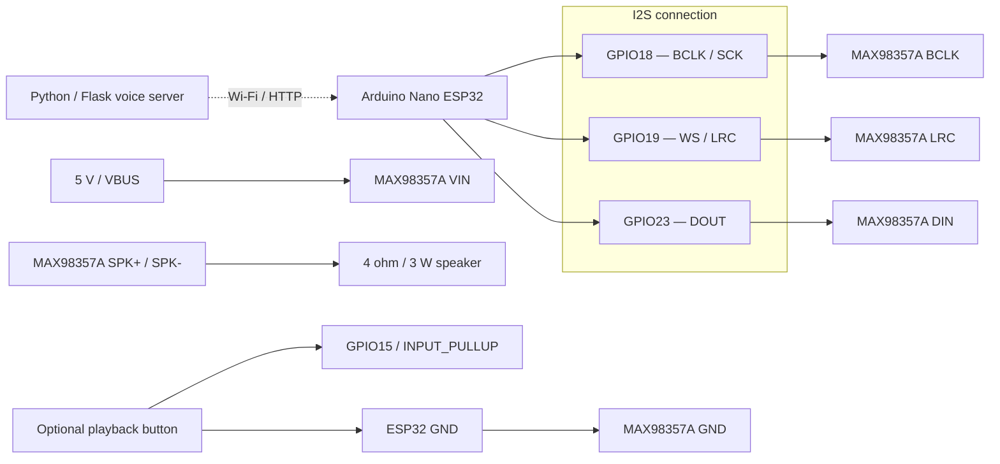

# B Test — Voice Pipeline

## What this prototype tests

This test validates the technical pipeline:

`consented family voice sample -> voice cloning -> TTS -> 16 kHz PCM -> ESP32 -> I2S -> MAX98357A -> speaker`

The AI processing runs on a local Python/Flask server. The ESP32 is only the physical playback endpoint.

## B-test voice pipeline flow



### What the flow validates

`Authorised sample → Voice clone → TTS → Network transfer → ESP32 playback`

This separates the AI layer from the physical-device layer: cloning and speech generation happen on the server, while the ESP32 fetches and plays the generated audio.

## B-test playback wiring diagram



### Example playback wiring

| Signal | Arduino Nano ESP32 | MAX98357A / part |
|---|---|---|
| I2S bit clock | `GPIO18` | `BCLK` |
| I2S word select | `GPIO19` | `LRC / WS` |
| I2S audio data | `GPIO23` | `DIN` |
| Amplifier power | `5V / VBUS` | `VIN` |
| Ground | `GND` | `GND` |
| Speaker | — | `SPK+` and `SPK-` |
| Optional playback trigger | `GPIO15` to button | other side of button to `GND` |

> **Pin note:** this is an example mapping for the playback sketch. The constants in `ESP32/LoveVoice_Voice_Playback.ino` and your physical wiring must match.

## B1 — Create an authorised voice clone

The Flask endpoint `/clone` accepts one voice sample and requires an explicit `consent_confirmed=true` field before it will call the voice-cloning API.

Use only a recording from the person whose voice is being cloned, with their explicit permission.

## B2 — Generate TTS audio

`/tts` takes a `voice_id` and text, generates **16 kHz raw PCM** and stores it locally as `generated/latest.pcm`.

## B3 — ESP32 playback

`ESP32/LoveVoice_Voice_Playback.ino` downloads `/audio/latest.pcm` over Wi-Fi and streams the PCM bytes through I2S to a MAX98357A amplifier and speaker.

## Server setup

```bash
cd B_Voice_Pipeline
python -m venv .venv
pip install -r requirements.txt
```

Copy `.env.example` to `.env`, add your own API key, then run:

```bash
python server.py
```

The local server starts on port `5001`.

## Example — clone a consented sample

```bash
curl -X POST http://127.0.0.1:5001/clone \
  -F "sample=@samples/family_voice.wav" \
  -F "voice_name=Love Voice Family Test" \
  -F "consent_confirmed=true"
```

The response returns a `voice_id`.

## Example — generate speech

```bash
curl -X POST http://127.0.0.1:5001/tts \
  -H "Content-Type: application/json" \
  -d '{"voice_id":"YOUR_VOICE_ID","text":"Mom, remember to take your medicine today."}'
```

The generated PCM becomes available at:

```text
http://YOUR_COMPUTER_IP:5001/audio/latest.pcm
```

## ESP32 setup

1. Wire Arduino Nano ESP32 to MAX98357A using BCLK, LRC/WS and DIN.
2. Copy `ESP32/secrets.example.h` to `ESP32/secrets.h`.
3. Enter your local Wi-Fi and `AUDIO_URL`.
4. Open `ESP32/LoveVoice_Voice_Playback.ino` in Arduino IDE.
5. Upload and open Serial Monitor at `115200`.
6. Press the playback button to download and play the latest generated PCM.

## What to record as test evidence

- Was a consented family sample accepted and converted into a reusable voice ID?
- Was TTS successfully generated in the intended familiar voice?
- Did the ESP32 download the audio successfully?
- Did I2S playback work through MAX98357A and the physical speaker?
- How long did the full sample -> TTS -> device playback loop take?
- Was AI-generated familiar speech clearly identified during the user test?

## Boundary

This is a portfolio / interaction prototype, not a production voice service. Do not use private recordings or identifiable personal data in public demos. Do not use a cloned voice without explicit consent.
