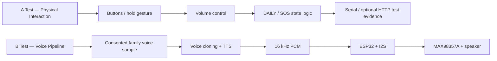

# Love Voice — Prototype Tests

This repository contains two separate technical prototype tests for the **Love Voice** interaction-design project.

## Prototype overview



## A Test — Physical Interaction

**Goal:** validate tangible input and device-state logic on Arduino Nano ESP32.

Tests:
- Heart button input
- Hold-to-Speak gesture
- Pull-to-adjust volume
- DAILY / SOS physical state transition
- SOS long-hold confirmation
- Optional Wi-Fi event logging

Detailed flowchart, wiring diagram and test instructions:

[`A_Physical_Interaction/README.md`](A_Physical_Interaction/README.md)

### A-test technical chain

`Physical control → GPIO / analog input → ESP32 state logic → event → test evidence`

## B Test — Voice Pipeline

**Goal:** validate the voice pipeline from an authorised family voice sample to generated speech and ESP32 playback.

Pipeline:

`Authorised family voice sample → voice cloning → TTS → PCM audio → ESP32 → I2S → MAX98357A → speaker`

Detailed flowchart, wiring diagram and test instructions:

[`B_Voice_Pipeline/README.md`](B_Voice_Pipeline/README.md)

### B-test technical chain


## Repository structure

```text
Love-Voice-MVP/
├── README.md
├── A_Physical_Interaction/
│   ├── README.md
│   ├── LoveVoice_Physical_Test.ino
│   ├── logger_server.py
│   ├── requirements.txt
│   └── secrets.example.h
└── B_Voice_Pipeline/
    ├── README.md
    ├── server.py
    ├── requirements.txt
    ├── .env.example
    ├── samples/
    ├── generated/
    └── ESP32/
        ├── LoveVoice_Voice_Playback.ino
        └── secrets.example.h
```

## Prototype Boundary

These files are for **interaction-design and technical-feasibility testing only**. They are not medical-device software and should not be used for emergency-critical deployment.

For voice cloning, use only recordings from a person who has explicitly consented to creation and use of the voice model. Never commit API keys, Wi-Fi credentials, private recordings, or generated personal voice files to this repository.
